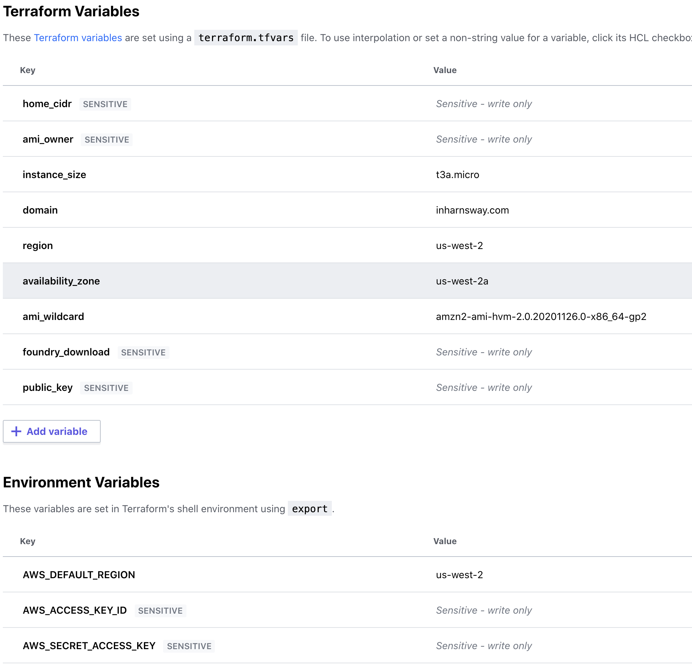

# Setup of FoundryVTT in AWS using Terraform
This guide assumes some familarity with AWS and limited familiarity with Terraform. I wrote it to get better at Terraform.

# Prerequisites
 - A domain that you control and can update the DNS records to point to AWS Route53
 - A valid license for Foundry VTT
 - A free account on terraform.io
 - An AWS account, with an IAM user with admin acces, access key
   and secret access key.

# Setup
 1. Fork this repo
 1. Create a Terraform workspace and point it to your new fork
 1. In the Variables section of your Terraform workspace, specify the following variables
    - home_cidr - required - your IP address to the word, followed by a /32. This will allow you to SSH to your server, and no one else. E.g. 34.56.78.90/32
    - domain - required - the domain you bought. Foundry will register itself as https://www.```${domain}```
    - public_key - required - the public key you use for ssh. On a mac or linux system it's located in ~/.ssh/id_rsa.pub. On Windows it varies based on what ssh program you use.
    - ami_wildcard - optional - The name (with a wildcard if you want) of the AMI to start from. E.g. ```amzn2-ami-hvm-2.0.20201126.0-x86_64-gp2```
    - ami_owner - optional - the owner of the AMI you want to use. This may be you, or it may be the amazon id ```137112412989```. (You can find this in the details portion of EC2->AMI section of the AWS console)
    - instance_size - optional - The EC2 instance type you want to use. t3a.micro works just fine.
    - region - optional - The region to deploy to. Pick one close to you and your players. 
    - foundry_download - optional - Your 5 minute URL for downloading FoundryVTT. If not provided, or if the software is already downloaded, then this variable has no effect. But it's required to get you started.
 1. Still in the Variables section, under environment variables, create/set the following variables (set to sensitive!)
    - AWS_ACCESS_KEY_ID
    - AWS_SECRET_ACCESS_KEY
    - AWS_DEFAULT_REGION (doesn't have to be set to sensitive)
 1. Here's what your variables screen should look like when done, if you specify all optional values:
    - 
 1. Get your 5-minute URL for downloading Foundry and put it into the variable ```foundry_download```. 
 1. Queue the running of the plan.
 1. Apply the plan.
 1. The plan may not succeed this round (if nothing else, it will fail to get the SSL cert), but now you have Route53 set-up.
 1. In the AWS console, go to Route53, go to your hosted zone, and for your domain get the ```value/route traffic to``` values for your name servers.
 1. Wherever your registered your domain, update its DNS records to point to the values from the previous step. This may take some 10-30 minutes to propogate to the wider internet.
 1. Terminate your ec2 instance if it's running.
 1. re-run your plan. Note that you may need to get a new 5-minute FoundryVTT download URL. Now the SSL cert should work.
 1. Log in to your FoundryVTT instance. You should be able to ssh to ec2-user@www.yourdomain.
 1. Edit the file foundrydata/Config/options.json and add the following
    ```
    "upnp": false,
    "hostname": "www.<yourdomain>",
    "dataPath": "/home/ec2-user/foundrydata",
    "proxySSL": true,
    "proxyPort": 443,
    ```
 1. Restart your foundry by executing ```sudo systemctl restart foundryvtt```
 1. Your foundry should be available at https://www.${domain}.
 1. Once you validate that your foundry is working, you will want to make an AMI of it so you don't have to get new 5-minute URLs all the time.
 1. After you make your AMI, update the variables to point to to the AMI name and owner.